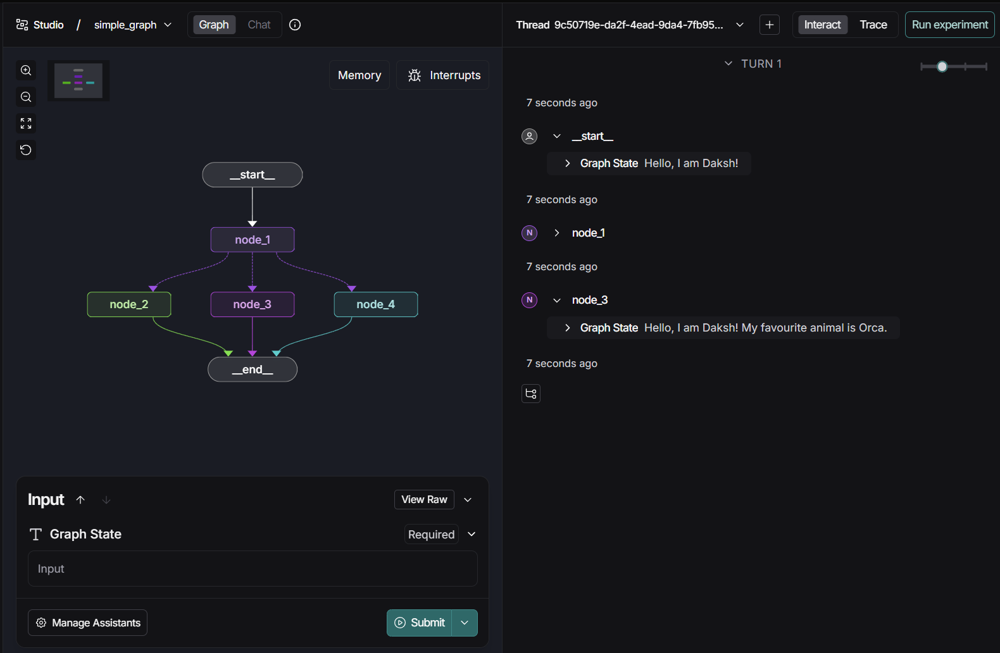
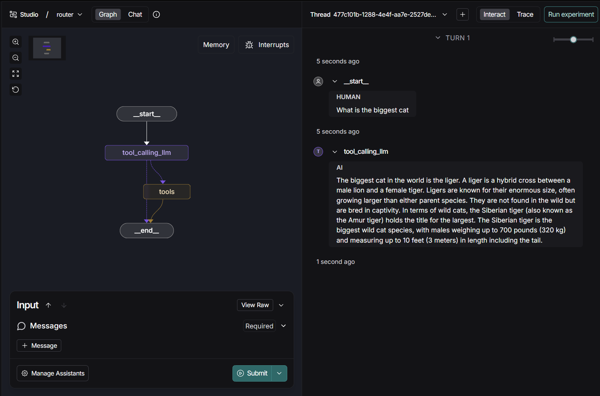
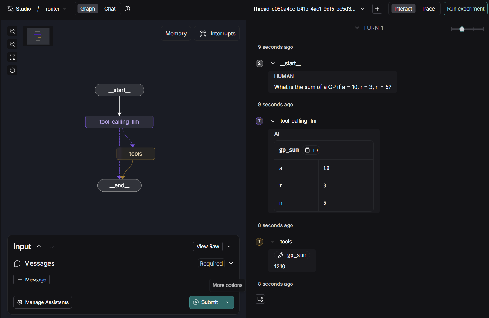
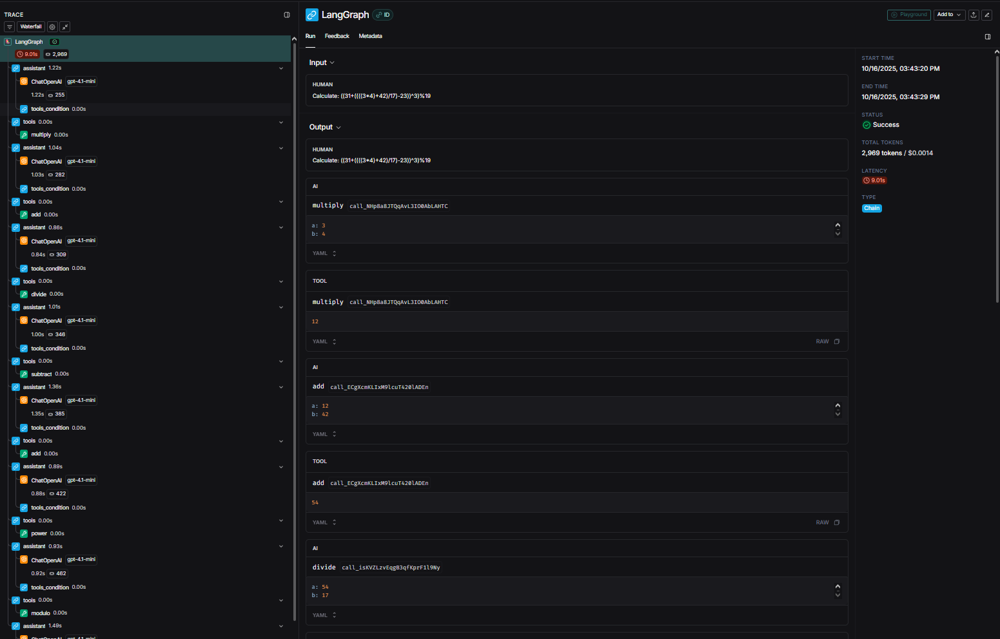

# Intro to Langgraph

---

## Module 0

---

[https://github.com/MAT496-Monsoon2025-SNU/DJ-22-langgraph-MAT496/blob/main/notebooks/module-0/basics.ipynb]()

This was a basic intro to stuff we have already done before. Learnt what **LangGraph** means and how to setup **LangSmith Studio**, which is a **custom IDE** for viewing and testing agents.

Changes:

* Changed the prompts in **basics.ipynb**

## Module 1

---

### Video 1: Motivation

Learnt that **Agent** is the control flow defined by **LLM**. Increasing **level of control** given to LLM drops the **reliability**. **LangGraph** is used to increase reliability when giving more control to LLM.

---

### Video 2: Simple Graph

[https://github.com/MAT496-Monsoon2025-SNU/DJ-22-langgraph-MAT496/blob/main/notebooks/module-1/simple-graph.ipynb]()

Learnt how to make a simple **graph** using **StateGraph()**. Graph decides next **conditional** step based on the parameters set, in this case random chance.

Changes:

* Changed the conditional statement in graph
* Added 3 options instead of 2

---

### Video 3: LangSmith Studio

[https://github.com/MAT496-Monsoon2025-SNU/DJ-22-langgraph-MAT496/blob/main/notebooks/module-1/simple.py]()

Learnt how to work with LangSmith Studio and use it to visualize the graph that were originally being seen in Jupyter notebook.

Changes:

* Updated simple.py to contain the graph that was made in simple-graph.ipynb

---

### Video 4: Chain

[https://github.com/MAT496-Monsoon2025-SNU/DJ-22-langgraph-MAT496/blob/main/notebooks/module-1/chain.ipynb]()

Learnt how to make **chains** by combining different concepts. Initially the messges are stored in a list, we also made a **tool**. Then the messages and tool are bound together in a graph to show a chain.

Changes:

* Changed the messages to real life application of DSA
* Changed the tool to calculate the prefix sum of a list

---

### Video 5: Router

[https://github.com/MAT496-Monsoon2025-SNU/DJ-22-langgraph-MAT496/blob/main/notebooks/module-1/router.ipynb]()

Learnt how to make the **LLM decide** whether to call a **tool** or not. If the question requires a tool call, the respective tool is called otherwiser the response is generated by the LLM itself. Also observed it in LangSmith Studio.

Changes:

* Created two new tools; **gp_sum()** and **ap_sum()**
* Handled the code for **multiple tools**

---

### Video 6: Agent

[https://github.com/MAT496-Monsoon2025-SNU/DJ-22-langgraph-MAT496/blob/main/notebooks/module-1/agent.ipynb]()

Learnt how to build a simple mathemtical expression solving **Agent**. It uses **ReAct Archiecture** in which model goes step by step recursively. The tools were repeatedly being called, as was the necessity for it.

Changes:

* Added new tools; **subtract()**, **power()**, **modulo()**
* Gave a complex mathemtical expression with various different operators

