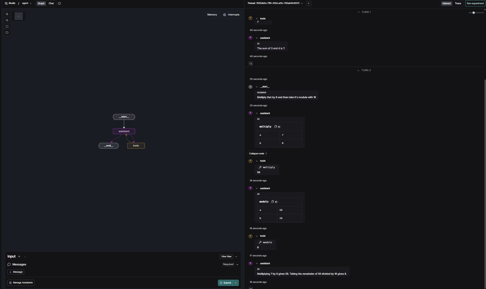

# Intro to Langgraph

---

## Module 0: Welcome to the Course

---

[https://github.com/MAT496-Monsoon2025-SNU/DJ-22-langgraph-MAT496/blob/main/notebooks/module-0/basics.ipynb]()

This was a basic intro to stuff we have already done before. Learnt what **LangGraph** means and how to setup **LangSmith Studio**, which is a **custom IDE** for viewing and testing agents.

Changes:

* Changed the prompts in **basics.ipynb**

---

## Module 1: Introduction

---

### Video 1: Motivation

Learnt that **Agent** is the control flow defined by **LLM**. Increasing **level of control** given to LLM drops the **reliability**. **LangGraph** is used to increase reliability when giving more control to LLM.

---

### Video 2: Simple Graph

[https://github.com/MAT496-Monsoon2025-SNU/DJ-22-langgraph-MAT496/blob/main/notebooks/module-1/simple-graph.ipynb]()

Learnt how to make a simple **graph** using **StateGraph()**. Graph decides next **conditional** step based on the parameters set, in this case random chance.

Changes:

* Changed the conditional statement in graph
* Added 3 options instead of 2

---

### Video 3: LangSmith Studio

[https://github.com/MAT496-Monsoon2025-SNU/DJ-22-langgraph-MAT496/blob/main/notebooks/module-1/simple.py]()

Learnt how to work with LangSmith Studio and use it to visualize the graph that were originally being seen in Jupyter notebook.

Changes:

* Updated simple.py to contain the graph that was made in simple-graph.ipynb

---

### Video 4: Chain

[https://github.com/MAT496-Monsoon2025-SNU/DJ-22-langgraph-MAT496/blob/main/notebooks/module-1/chain.ipynb]()

Learnt how to make **chains** by combining different concepts. Initially the messges are stored in a list, we also made a **tool**. Then the messages and tool are bound together in a graph to show a chain.

Changes:

* Changed the messages to real life application of DSA
* Changed the tool to calculate the prefix sum of a list

---

### Video 5: Router

[https://github.com/MAT496-Monsoon2025-SNU/DJ-22-langgraph-MAT496/blob/main/notebooks/module-1/router.ipynb]()

Learnt how to make the **LLM decide** whether to call a **tool** or not. If the question requires a tool call, the respective tool is called otherwiser the response is generated by the LLM itself. Also observed it in LangSmith Studio.

Changes:

* Created two new tools; **gp_sum()** and **ap_sum()**
* Handled the code for **multiple tools**

---

### Video 6: Agent

[https://github.com/MAT496-Monsoon2025-SNU/DJ-22-langgraph-MAT496/blob/main/notebooks/module-1/agent.ipynb]()

Learnt how to build a simple mathemtical expression solving **Agent**. It uses **ReAct Archiecture** in which model goes step by step recursively. The tools were repeatedly being called, as was the necessity for it.

Changes:

* Added new tools; **subtract()**, **power()**, **modulo()**
* Gave a complex mathemtical expression with various different operators

---

### Video 7: Agent with Memory

[https://github.com/MAT496-Monsoon2025-SNU/DJ-22-langgraph-MAT496/blob/main/notebooks/module-1/agent-memory.ipynb]()

Learnt how to use **Agent** with **Memory**. Using **MemorySaver()**, we can create a checkpoint for the Agent and then store it in its memory. We can call the next command based on the output of the previous one using this. In **LangSmith Studio** this is not required as there is an in-built **persistence layer** which makes the Agent have memory by default using the **API** key.

Changes:

* Added the tools I had made in **agent.ipynb**
* Made a **loop** that calls all the tools, calculating on the output of the previous call and a random number

---

## Module 2: State and Memory

---

### Video 1: State Schema

[https://github.com/MAT496-Monsoon2025-SNU/DJ-22-langgraph-MAT496/blob/main/notebooks/module-2/state-schema.ipynb]()

Learnt about typed state schemas, **TypedDict**, **dataclass** and **Pydantic** which allows all the nodes to share consistent contact with **LangGraph**.

Changes:

* Changed the conditional statement in graph
* Added 3 options instead of 2

---

### Video 2: State Reducers

[https://github.com/MAT496-Monsoon2025-SNU/DJ-22-langgraph-MAT496/blob/main/notebooks/module-2/state-reduces.ipynb]()

Learnt that **reducers** let sibling nodes to safely merge updates. **Annotated** keys can change between **overwrite**, **append** or **custom** **merge** without rewriting.

Changes:

* Changed arithmetic operation and foo to val
* Changed the messages to real life application of DSA

---

### Video 3: Multiple Schemas

[https://github.com/MAT496-Monsoon2025-SNU/DJ-22-langgraph-MAT496/blob/main/notebooks/module-2/multiple-schemas.ipynb]()

Learnt that there are **Private** **States** and **Overall** **States**. Private allow the nodes to exchange temporary variables without affecting the final output. **Internal** **schemas** preserve all working fields for logic.

Changes:

* Added another **processing node** in between **node_1** and **node_3**

---

### Video 4: Trim and Filter Messages

[https://github.com/MAT496-Monsoon2025-SNU/DJ-22-langgraph-MAT496/blob/main/notebooks/module-2/trim-filter-messages.ipynb]()

Learnt how **filters** and **trimmers** control chat history of the model and also help in saving **token** **usage**. Maintaining **consistent** **message channels** is essential for **reshaping** **chat thread** without breaking **LangGraph** structure.

Changes:

* Changes the topic of research from ocean mammals to Panthera genus

---

### Video 5: Chatbot with Summarizing Messages and Memory

[https://github.com/MAT496-Monsoon2025-SNU/DJ-22-langgraph-MAT496/blob/main/notebooks/module-2/chatbot-summarization.ipynb]()

Learnt how to **summarize** to compress **conversation** **history** as **LangGraph** handles persistence. Conditional edge helps the chatbot to decide when to **refresh** its **context** to avoid processing each message repeatedly.

Changes:

* Changed the topic of conversation to FC Barcelona

---

### Video 6: Chatbot with Summarizing Messages and External Memory

[https://github.com/MAT496-Monsoon2025-SNU/DJ-22-langgraph-MAT496/blob/main/notebooks/module-2/chatbot-external-memory.ipynb]()

Learnt how to use **external memory** using **Sqlite** which allows the chatbot to continue the conversation to continue from the previous context without any problems.

Changes:

* Changed the topic of conversation to FC Barcelona

---

## Module 3: UX and Human-in-the-Loop

---

### Video 1: Streaming

[https://github.com/MAT496-Monsoon2025-SNU/DJ-22-langgraph-MAT496/blob/main/notebooks/module-3/streaming-interruption.ipynb]()

Learnt how to **stream** real-time updates. **updates** shows updates after calling a node. **values** shows full state after calling a node.

Changes:

* Changed the prompt
* Used **.astream_events** to stream tokens from **summarize_conversation**

---

### Video 2: Breakpoints

[https://github.com/MAT496-Monsoon2025-SNU/DJ-22-langgraph-MAT496/blob/main/notebooks/module-3/breakpoints.ipynb]()

Learnt that **breakpoints** are used to take **approval/debug/edit** from the user.

Changes:

* Changed the prompt
* Added more basic arithmetic tools
* Added **breakpoint** before assistant node
* Modified **agent.py** to add **interrupt_before**

---

### Video 3: Editing State and Human Feedback

[https://github.com/MAT496-Monsoon2025-SNU/DJ-22-langgraph-MAT496/blob/main/notebooks/module-3/edit-state-human-feedback.ipynb]()

Learnt that breakpoints can modify the state of the graph as well.

Changes:

* Added more basic arithmetic tools
* Changed the prompt

---

### Video 4: Dynamic Breakpoints

[https://github.com/MAT496-Monsoon2025-SNU/DJ-22-langgraph-MAT496/blob/main/notebooks/module-3/dynamic-breakpoints.ipynb]()

Learnt that **dynamic breakpoints** allow the graph to interrupt itself using **NodeInterrupt()**.

Changes:

* Add dynamic breakpint to check for special characters

---

### Video 5: Time Travel

[https://github.com/MAT496-Monsoon2025-SNU/DJ-22-langgraph-MAT496/blob/main/notebooks/module-3/time-travel.ipynb]()

Learnt how to **time‑travel** through checkpoints to **replay**, **fork**, and **edit** agent state for **approval**, **debugging**, and **editing** without rerunning the whole graph.

Changes:

* Changed the prompt
* Added more basic arithemtic tools

---

## Module 4: Building Your Assistant

---

### Video 1: Parallelization

[https://github.com/MAT496-Monsoon2025-SNU/DJ-22-langgraph-MAT496/blob/main/notebooks/module-4/parallelization.ipynb]()

Learnt how to use **parallel** nodes and reducers to build **Web Search Agent**. When multiple noders are ran in parallel, **LangGraph** sets default order but custom order can also be set.

Changes:

* Added more nodes
* Changed the prompt

---

### Video 2: Sub-Graphs

[https://github.com/MAT496-Monsoon2025-SNU/DJ-22-langgraph-MAT496/blob/main/notebooks/module-4/sub-graph.ipynb]()

Learnt how to build **sub-****graphs** within a graph. Information is passed in-between them using **overlapping keys**. **Tracers** are more readable in **LangSmith UI**.

Changes:

* Created a node, **final_summary**, to make a final summary of both the parallel processes.

---

### Video 3: Map-Reduce

[https://github.com/MAT496-Monsoon2025-SNU/DJ-22-langgraph-MAT496/blob/main/notebooks/module-4/map-reduce.ipynb]()

Learnt how to break down a task into smaller **sub-taks** and then combine the results of all the parallel sub-tasks.

Changes:

* Changed the prompt to interesting facts

---

### Video 4: Research Assistant

[https://github.com/MAT496-Monsoon2025-SNU/DJ-22-langgraph-MAT496/blob/main/notebooks/module-4/research-assistant.ipynb]()

Learnt how to combine all the previous learnings to build a **Research Assistant** model. 

Changes:

* Changed the prompt
* Added in hands-on experience experts for the interview

